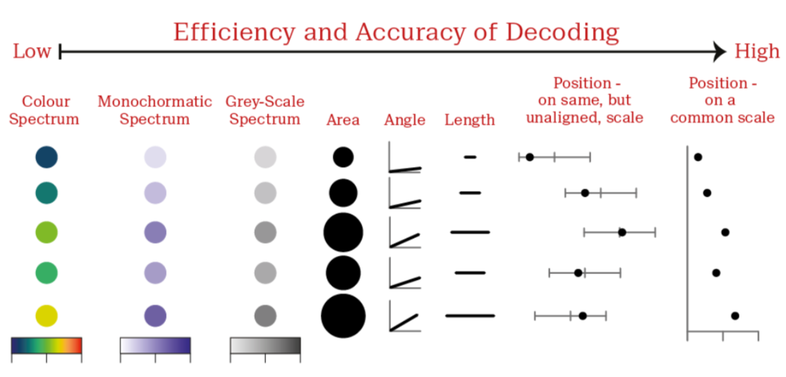
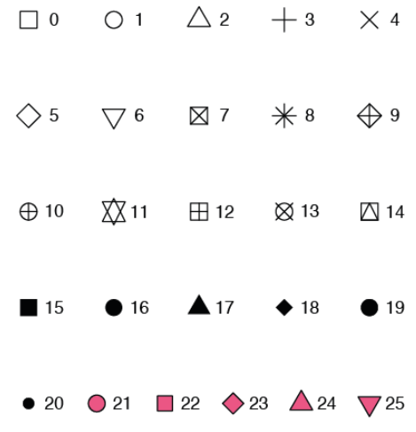
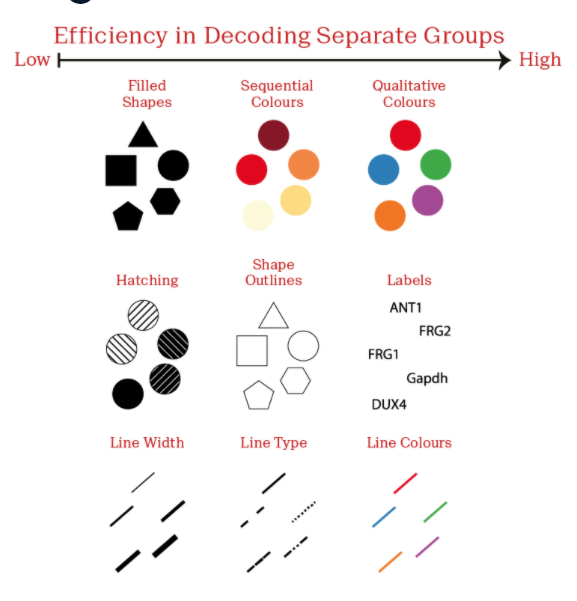
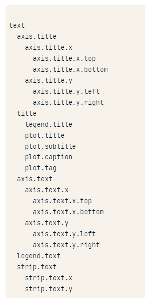
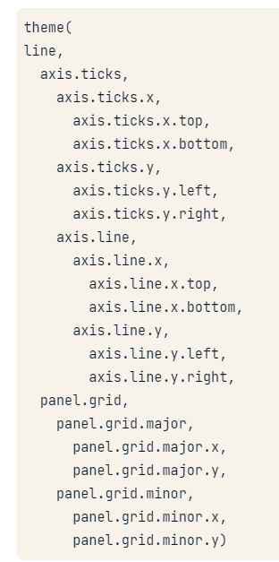
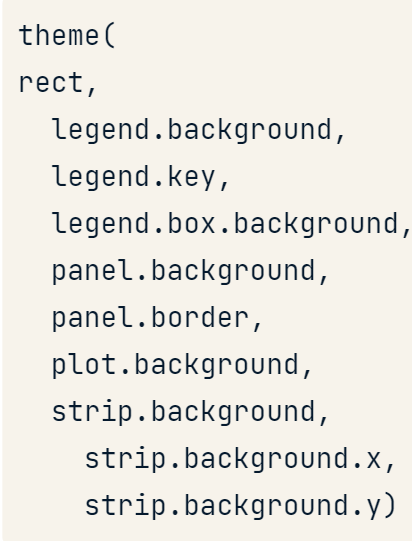

# Introduction to data visualisation with ggplot2

## Chapter 1 - Introduction
### Section 1 - Introduction

#### Exploratory vs. explanatory analysis
- Exploratory - confirm and analyse
- Explanatory - inform and persuade

### Loading dataset
```{r}
library(MASS)
library(ggplot2)
mammals
```

#### A Scatter plot
```{r}
ggplot(mammals, aes(x = body, y = brain)) +
  geom_point()
```

#### Explore with a linear model
- Poor choice, since a few extreme values have a large influence
```{r}
ggplot(mammals, aes(x = body, y = brain)) +
  geom_point(alpha = 0.6) +
  stat_smooth(
    method = "lm",
    color = "red",
    se = FALSE
  )
```
#### Explore - fine tuning
- Log transformation allows for a better fit
```{r}
ggplot(mammals, aes(x = body, y = brain)) +
  geom_point(alpha = 0.6) +
  coord_fixed() +
  scale_x_log10() +
  scale_y_log10() +
  stat_smooth(
    method = "lm",
    color = "#C42126",
    se = FALSE,
    size = 1
  )
```

#### Anscombe's plots
- Example of how different datasets can lead to the same linear plots despite different relationships

#### Using factors in scatter plots
- Wrap `factor()` around the variable and the axis will adjust to show only the relevant points

### Section 2 - The grammar of graphics
- Build on an underlying grammar

#### The grammar of graphics
- Plotting framework
- Leland Wilkinson 1999
- 2 principles
  - Graphics = distinct layers of grammatical elements
  - Meaningful plots through aesthetic mappings
  
#### The three essential grammatical elements
- Data - the data-set being plotted
- Aesthetics - the scales onto which we *map* our data
- Geometrics - the visual elements used for our plot
- Themes - all non-data ink
- Statistics - representations of our data to aid understanding
- Coordinates - the space on which the data will be plotted
- Facets - plotting small multiples

#### Understanding variables
- can use color inside aes
- can use size inside aes
- can use shape inside aes - data must be categorical

### Section 3 - ggplot2 layers
#### ggplot2 package
- The grammar of graphics is implemented in R
- Two key concepts:
  1. Layer grammatical elements
  2. Aesthetic mappings
  
#### Data
- Bottom layer
- Using - iris dataset
```{r}
iris
```

#### Aesthetics
- Next layer
- Tells us scales we should map our data to
- Establish aesthetic mappings
- `sepal.length = x`
- `sepal.width = y`

#### Geometrics
- Allows us to choose how the plot will look
```{r}
g <- ggplot(iris, aes(x = Sepal.Length, y = Sepal.Width)) +
  geom_jitter()
g
```
#### Themes
- Controls all non-data ink on plot
```{r}
g <- g +
  labs(x = "Sepal Length (cm)", y = "Sepal Width (cm)") +
  theme_classic()
g
```
#### Adding geometries
- geom_point() - adds points (as in a scatter plot)
- geom_smooth() - adds a smooth trend curve
- These can be labelled

#### Changing one geom or every geom
- Mapping an aesthetic to data variable inside the call to `ggplot()` will change *all* the geoms
- It is also possible to make changes to *individual* geoms by passing arguments to the `geom_*()` functions
- E.g. geom_point(alpha = 0.4)

#### Saving plots as variables
- Plots can be saved as variables, which can be added to later on using the `+` operator. This is useful if you want to make multiple related plots from a common base 


## Chapter 2 - Aesthetics
### Section 1 - Visible aesthetics
#### Mapping onto the X and Y axes
```{r}
ggplot(iris, aes(x = Sepal.Length, y = Sepal.Width, color = Species)) +
  geom_point()
```

- Mapping sepal length onto X aesthetic, sepal width onto y aesthetic
- species can be mapped onto the color aesthetic
- Map aesthetics in the `aes()` function
- Could call in the `geom_*()` function
  - Typically only necessarily if all layers should *not* inherit the same aesthetics
  - Or if mixing different data sources
- Try to keep data and ggplot aesthetics in the same function definition 
- Typical visible aesthetics
  - x
  - y
  - fill - fill color
  - color - color of points, outlines of other geoms
  - size - area of radius of points, thinkness of lines
  - alpha - transparency
  - linetype - line dash pattern
  - labels - text on a plot or axes, categorical data only
  - shape - point shape, categorical data only
  
- Function as both aes and attributes

#### All about aesthetics: color, shape and size
- Aesthetics you can consider within aes:
  - `x`
  - `y`
  - `color`
  - `fill`
  - `size`
  - `alpha`
  - `labels`
  - `shape` - 1 (empty circles)
- Common convention - you don't name the `x` and `y` arguments to `aes()` as they always come first, but you do name the other arguments

#### All about aesthetics: color vs. fill
- `color` typically changes the *outline* of a geom and the `fill` aesthetic changes the inside
- `geom_point()` is an exception - you use `color` (not `fill`) for the point color, but some shapes have special behaviour
- The default `geom_point()` uses `shape = 19`, a solid circle
- An alternative is `shape = 21` - a circle that allows you to use *both* `fill` for the inside and `color` for the outside 

### Section 2 - Using attributes
- Attributes - how something looks
- All visible aesthetics also exist as attributes
- Attributes always called in the geom layer
```{r}
ggplot(iris, aes(x = Sepal.Length, y = Sepal.Width)) +
  geom_point(color = 'red')
```

- e.g. Color - attribute set using color argument
-  size
- shape

- You can use all the aesthetics as attributes (but as attributes, they are not mapped to variables)
- E.g. Setting labels to row names `labels = rownames(series)`

### Section 3 - Modifying aesthetics
#### Positions
- Adjustment for overlapping
  - `identity` - the most straightforward position, default - value in df is where it is positioned in the plot
  - `dodge` - for bars this unstacks bars and sets side-by-side
  - `stack`
  - `fill`
  - `jitter`
  - `jitterdodge`
  - `nudge`
  
```{r}
ggplot(iris, aes(x = Sepal.Length,
                 y = Sepal.Width,
                 color = Species)) +
  geom_point(position = "identity")
```
- Too much overplotting to distinguish the points
- Need to add some random noise on the x and y axes to see regions of high density - jittering
```{r}
ggplot(iris, aes(x = Sepal.Length,
                 y = Sepal.Width,
                 color = Species)) +
  geom_point(position = "jitter")
```

- Each position type can be used as an argument or accessed as a function
```{r}
posn_j <- position_jitter(0.1)

ggplot(iris, aes(x = Sepal.Length,
                 y = Sepal.Width,
                 color = Species)) +
  geom_point(position = posn_j)
```
- Benefits of using as function
   - Can set arguments for the position - such as how much random noise should be added
   - Allows for consistency across plots and layers
- Applies for all other position attributes

#### Scale functions
- Each of the aesthetics is a scale that we map the data onto
- We can access all scales with the `scale_` functions
- The second part specifies which scale we want to modify
- All aesthetics have an associated scale function
  - `scale_x_*()`
  - `scale_y_*()`
  - `scale_color_*()` (also `scale_colour_*()`)
  - `scale_fill_*()`
  - `scale_shape_*()`
  - `scale_linetype_*()`
  - `scale_size_*()`
- Scale functions - must be appropriate for the type of data we are using
  - **`scale_x_continuous()`**
  - `scale_y_*()`
  - **`scale_color_discrete()`**
    - Alternatively, `scale_colour_*()`
  - `scale_fill_*()`
  - `scale_shape_*()`
  - `scale_linetype_*()`
  - `scale_linetype_*()`
  - `scale_size_*()`

#### `scale_*_*()
```{r}
ggplot(iris, aes(x = Sepal.Length,
                 y = Sepal.Width,
                 color = Species)) +
  geom_point(position = 'jitter') +
  scale_x_continuous("Sepal Length") +
  scale_color_discrete("Species")
```

#### The limits argument
- Describe the scales range
```{r}
ggplot(iris, aes(x = Sepal.Length,
                 y = Sepal.Width,
                 color = Species)) +
  geom_point(position = 'jitter') +
  scale_x_continuous("Sepal Length",
                     limits = c(2,8)) +
  scale_color_discrete("Species")
```
#### The breaks argument
- Control tickmarks positions
```{r}
ggplot(iris, aes(x = Sepal.Length,
                 y = Sepal.Width,
                 color = Species)) +
  geom_point(position = 'jitter') +
  scale_x_continuous("Sepal Length",
                     limits = c(2,8),
                     breaks = seq(2, 8, 3)) +
  scale_color_discrete("Species")
```
#### The expand argument
- Numerical factor of length 2, giving a multiplicative, additive constant, used to expand the range of the scales so that there is a small gap between the data and the axes
```{r}
ggplot(iris, aes(x = Sepal.Length,
                 y = Sepal.Width,
                 color = Species)) +
  geom_point(position = 'jitter') +
  scale_x_continuous("Sepal Length",
                     limits = c(2,8),
                     breaks = seq(2, 8, 3),
                     expand = c(0,0)) +
  scale_color_discrete("Species")
```
#### The labels argument
```{r}
ggplot(iris, aes(x = Sepal.Length,
                 y = Sepal.Width,
                 color = Species)) +
  geom_point(position = 'jitter') +
  scale_x_continuous("Sepal Length",
                     limits = c(2,8),
                     breaks = seq(2, 8, 3),
                     expand = c(0,0),
                     labels = c("Setosa", "Versicolor", "Virginica")) +
  scale_color_discrete("Species")
```

#### labs()
- To quickly change the axis labels
```{r}
ggplot(iris, aes(x = Sepal.Length,
                 y = Sepal.Width,
                 color = Species)) +
  geom_point(position = 'jitter') +
  labs(x = "Sepal Length", y = "Sepal Width", color = "Species")
```

#### Updating aesthetic labels
- `scale_color_manual()` 
  - Defines the properties of the color scale (i.e. axis)
  - The first argument sets the legend title
  - `values` is a named vector of colors to use
  
#### Setting a dummy aesthetic
- You can make univariate plots in `ggplot2` but you will need to add a fake y axis by mapping `y` to zero
- When setting y-axis limits, you can specify the limits as separate arguments, or as a single numeric vector. That is, `ylim(lo, hi)` or `ylim(c(lo, hi))`

### Section 4: Aesthetics best practices
#### Which aesthetics?
- Some clear guidelines to follow
- Jacques Bertin - The Semiology of Graphics, 1967
- William Cleveland
  - The Elements of Graphing Data, 1985
  - Visualizing Data, 1993
  
#### Form follows function
- Function depends on audience
- Primary:
  - Accurate and efficient representations
- Secondary:
  - Visually appealing, beautiful plots
  
- Guiding principles:
  - Never - misrepresent or obscure data, or confuse viewers with complexity
  - Always - consider the audience and purpose of every plot
  
#### Extracting information from data
- Encoding numbers and text into visual medium

#### The best choices for aesthetics
- Efficient - provides a faster overview than numeric summaries
- Accurate - minimises information loss

#### Choices for mapping continuous variables

- Color good for categorical variables
- Watch out for overplotting
  - Could adjust position
  
## Chapter 3 - Geometrics
- Determines how the plot actually looks
### Section 1 - Scatter plots
- Currently 48 geometries

#### Common plot types
- Scatter plots
  - points, jitter, abline, smooth, count
  - x and y essential
  - optional - alpha, color, fill, shape, size, stroke  
  
#### Scatter plots
- Each geom can accept specific aesthetic mappings, e.g. geom_point()
```{r}
ggplot(iris, aes(x = Sepal.Length,
                 y = Sepal.Width)) +
  geom_point()
```
### Geom-specific aesthetic mappings
```{r}
# Same as plot below
ggplot(iris, aes(x = Sepal.Length,
                 y = Sepal.Width)) +
  geom_point()

# Same as plot above
ggplot(iris, aes(x = Sepal.Length,
                 y = Sepal.Width)) +
  geom_point(aes(color = Species))

```

- You can control aesthetic mappings of each layer independently

#### Summary statistics
```{r}
library('dplyr')
iris %>%
  group_by(Species) %>%
  summarise_all(mean) -> iris.summary # Summary statistics
```

- ggplot2 can take care of stats for us
```{r}
ggplot(iris, aes(x = Sepal.Length,
                 y = Sepal.Width,
                 col = Species)) +
  # Inherits both data and aes from ggplot
  geom_point() +
  # Different data, but inherited aes
  geom_point(data = iris.summary, shape = 15, size = 5)
```


 - 21 - 25 have shape and fill that can be controlled independently

```{r}
ggplot(iris, aes(x = Sepal.Length, y = Sepal.Width, col = Species)) +
  geom_point() + 
  geom_point(data = iris.summary, shape = 21, size = 5, fill = "black", stroke = 2)
```
  - Note - not fair to plot the mean without some indication of sd - further info in the stats section
  
#### Position = "jitter"
```{r}
ggplot(iris,
       aes(x = Sepal.Length,
           y = Sepal.Width,
           col = Species)) +
  geom_point(position = "jitter")
```

- `geom_jitter()` a short-cut to `geom_point(position = "jitter")`
- Combine jittering with alpha-blending if necessary
- Hollow circules also help (`shape = 1`)
  - If use this, not also necessary to use alpha blending
- Jitter can be a geom itself (`geom_jitter()`), an argument in geom_point() (`position = jitter`), or a position function (i.e. `position_jitter()`)  

### Section 2 - Histograms
#### Common plot types
- Bar plots
  - Histogram, bar, col, errorbar

#### Histograms
- A plot of binned values
  - i.e. a statistical function
```{r}
ggplot(iris, aes(x = Sepal.Width)) + geom_histogram()
```
- Geom is associated with a particular statistic - 'stat_bin()'
  - Default = 30
```{r}
ggplot(iris, aes(x = Sepal.Width)) + 
  geom_histogram(binwidth = 0.1)
```

- Always set meaningful bin widths for your data
- No spaces between bars
- x-labels are between bars

#### Re-position tick marks
```{r}
ggplot(iris, aes(x = Sepal.Width)) + 
  geom_histogram(binwidth = 0.1,
                 ceneter = 0.05)
```

#### Different species
```{r}
ggplot(iris, aes(x = Sepal.Width, fill = Species)) +
  geom_histogram(binwidth = 0.1,
                 ceneter = 0.05,
                 position = 'stack')
```
- Difficult to see if bars overlapping or stacked - default is stacked
- Can also `dodge` bars - offset

```{r}
ggplot(iris, aes(x = Sepal.Width, fill = Species)) +
  geom_histogram(binwidth = 0.1,
                 ceneter = 0.05,
                 position = 'dodge')
```

- `position = "fill"`
  - Fills to represent the proportion of all observations
  
```{r}
ggplot(iris, aes(x = Sepal.Width,
                 fill = Species)) +
  geom_histogram(binwidth = 0.1,
                 center = 0.05,
                 position = 'fill')
```
- An internal variable called `density`, can be accessed by using the `..` notation, i.e. `..density..`
- Plotting this variable will show the relative frequency, which is the height times the width of each bin (i.e. normalises the histogram)

### Section 3 - Bar plots
# Bar plots, with a categorical x-axis
- Use `geom_bar()` or `geom_col()`
  - `geom_bar()` 
    - stat = "count"
    - counts the number of cases at each x position
  - `geom_col()`
    - stat = "identity"
    - plots actual values
- All positions from before are available
- Two types
  - Absolute counts
  - Distributions

#### Habits of mammals
```{r}
str(msleep)
ggplot(msleep, aes(vore)) +
  geom_bar()
```

- Default value - bin set for stat argument
- Useful for quick visual output

#### Plotting distributions instead of absolute counts
```{r}
# Calculate descriptive statistics
library(tidyr)
iris_summ_long <- iris %>%
  select(Species, Sepal.Width) %>%
  gather(key, value, -Species) %>%
  group_by(Species) %>%
  summarise(avg = mean(value),
            stdev = sd(value))

iris_summ_long
```

#### Plotting distributions
```{r}
ggplot(iris_summ_long, aes(x = Species,
                           y = avg)) +
  geom_col() +  # Use geom_col as already calculated
  geom_errorbar(aes(ymin = avg - stdev,
                    ymax = avg + stdev),
                width = 0.1)
```

### Section 4 - Line plots
```{r}
data(beavers)
str(beaver1)
str(beaver2)
```
#### Beaver
```{r}
ggplot(beaver1, aes(x = time, y= temp,
                    color = factor(activ))  # Color each segment of line according to weather beaver was active or not
       ) + geom_line()
```
#### Using aesthetics to differentiate multiple series
Options include:
  - `linetype = Species`
  - `size = Species`
  - `color = Species`
  - `fill = Species` - defaults to geom_stack
  
#### Aesthetics for categorical variables


#### geom_ribbon()
- Used for looking at overlapping areas
- Need to force y-min to be 0
```{r}
ggplot(fish, aes(x = Year,
                 y = Capture,
                 fill = Species)) +
  geom_ribbon(aes(ymax = Capture, ymin = 0), alpha = 0.3)
```

#### Using groupings

```{r}
ggplot(fish.tidy, aes(x = Year, y = Capture, color = Species)) +
  geom_line(aes(group = Species))
```

## Chapter 4 - Themes
### Section 1 - Themes from scratch
- Controls all non-data ink, i.e. visual elements not part of the data
- Three types
  - Text -> `element_text()`
  - Line -> `element_line()`
  - Rectangle -> `element_rect()`

```{r}
ggplot(iris, aes(x = Sepal.Length, y = Sepal.Width, color = Species)) +
  geom_jitter(alpha = 0.6)
```
#### Text elements

  
#### Adjusting theme elements
```{r}
ggplot(iris, aes(x = Sepal.Length, y = Sepal.Width, color = Species)) +
  geom_jitter(alpha = 0.6) +
  theme(axis.title = element_text(color = "blue"))  # Changes the axis font colours to blue
```

#### Line elements


#### Rect elements


#### Hierarchical naming reflects inheritance rules
- If we change text using an upstring argument, all downstream text will be affected

#### `element_blank()`
- Can be used to remove any item

#### Modifying whitespace
- Whitespace - all non-visible margins and spacing in the plot
- To set a single whitespace value, use `unit(x, unit)` where `x` is the amount and `unit` is the unit of measure
- Borders require you to set 4 positions, so use `margin(top, right, bottom, left, unit)`
  - To remember the order think TRouBLe
- Default unit is `pt` (points), which scales well with text. Other options include "cm", "in" and "lines" (of text)

### Section 2 - Theme Flexibility
#### Ways to use themes
1. From scratch
2. Theme layer object
3. Built-in themes - ggplot2 or ggthemes packages
4. Built-in themes from other packages
5. Update/set default theme

#### Defining theme objects
- Useful when you have many plots
- Provides consistency in style
- Apply a specific theme everywhere

```{r}
z <- ggplot(iris, aes(x = Sepal.Length, y = Sepal.Width, color = Species)) +
  geom_jitter(alpha = 0.6) +
  scale_x_continuous("Sepal Length (cm)", limits = c(4,8), expand = c(0,0)) +
  scale_y_continuous("Sepal Width (cm)", limits = c(1.5,5), expand = c(0,0)) +
  scale_color_brewer("Species", palette = "Dark2", labels = c("Setosa", "Versicolor", "Virginica"))
z
```
#### Defining theme objects
```{r}
z + theme(text = element_text(family = "serif", size = 14),
          rect = element_blank(),
          panel.grid = element_blank(),
          title = element_text(color = "#8b0000"),
          axis.line = element_line(color = "black"))
```
#### Defining theme objects
- Saving layer as object
```{r}
theme_iris <- theme(text = element_text(family = "serif", size = 14),
          rect = element_blank(),
          panel.grid = element_blank(),
          title = element_text(color = "#8b0000"),
          axis.line = element_line(color = "black"))
```

#### Reusing theme objects
```{r}
z + theme_iris
```
#### Reusing theme objects
```{r}
m <- ggplot(iris, aes(x = Sepal.Width)) +
  geom_histogram(binwidth = 0.1,
                 center = 0.05)
m
```
```{r}
m +
  theme_iris
```

- You can add a theme as well as amend specific elements
```{r}
m +
  theme_iris +
  theme(axis.line.x = element_blank())
```
#### Using built-in themes
- Use `theme_*()` functions to access built-in themes
```{r}
z + theme_classic()
```

- Can modify any specific theme element

#### The ggthemes package
- Use the ggthemes package for more functions
- tufte - removes all non-data ink and sets font to serif
```{r}
library(ggthemes)
z +
  theme_tufte()
```
#### Updating themes
- Updating done with `theme_update` function
- Updates default and saves to the object original
```{r}
original <- theme_update(text = element_text(family = "serif", size = 14),
                        rect = element_blank(),
                        panel.grid = element_blank(),
                        title = element_text(color = "#8b0000"),
                        axis.line = element_line(color = "black"))
```

#### Setting themes
```{r}
theme_set(original)
```

#### Built-in themes
- Out of the box solutions
  - `theme_gray()` - default
  - `theme_bw()` - useful when you use transparency
  - `theme_classic()` - is more traditional
  - `theme_void()` - removes everything but the data
  
#### Exploring ggthemes
- `theme_fivethirtyeight()`
- `theme_tufte()`
- `theme_wsj()`

#### Setting themes
- Reusing a theme across many plots helps to provide a consistent style. Options for doing this:
  1. Assign the theme to a variable, and add it to each plot
  2. Set your theme as the default using `theme_set()`
  
### Section 3 - Effective explanatory plots
#### First explanatory plots - distributions
```{r}
ggplot(gm2007_full_arranged, aes(index, lifeExp)) +
  geom_point()
```

- Removing non-data ink makes for a great plot
- Adding a threshold line helps to orientate the viewer
- `geom_curve()` - good for joining curved lines, e.g. adding little arrows on plots
- `geom_segment()` adds line segments - aesthetics - `xend` and `yend`
- `geom_text()` - adds labels
- `geom_vline()` - adds vertical lines

# Intermediate data visualisation with ggplot2

## Chapter 1 - Intermediate data visualisation with ggplot2
### Section 1 - Stats with geoms
#### Statistics layer
- Two categories of function
  - Called within a geom
  - Called independently

- `stats_`

#### geom_ <-> stat_
```{r}
p <- ggplot(iris, aes(x = Sepal.Width))
p + geom_histogram()
```
- Could have produced the same result if we had used `geom_bar()`

```{r}
p <- ggplot(mtcars, aes(x = factor(cyl), fill = factor(am)))
p + geom_bar()
p + stat_count()
```

- `geom_bar()` calls `stat_count()` under the hood and vice versa

#### The geom_/stat_ connection
- `stat_bin()` -> `geom_histogram()`, `geom_freqpoly()`
- `stat_count()` -> `geom_bar()`
- `stat_smooth()` -> `geom_smooth()`
- `stat_boxplot()` -> `geom_boxplot()` -- useful for summarising data
- `stat_bindot()` -> `geom_dotplot()` -- useful for v. large datasets
- `stat_bin2d()` -> `geom_bin2d()` -- useful for v. large datasets
- `stat_binhex()` -> `geom_hex()`
- `stat_contour()` -> `geom_contour()` -- useful for v. large datasets
- `stat_quantile()` -> `geom_quantile()`
- `stat_sum()` -> `geom_count()`

- Generally don't have to call the functions directly

#### `stat_smooth()`
- Can be accessed with `geom_smooth()`

```{r}
ggplot(iris, aes(x = Sepal.Length,
                 y = Sepal.Width,
                 color = Species)) +
  geom_point() +
  geom_smooth()
```

- Standard error is shown as a grey ribbon behind smooth is by default 95% CI
- Can remove by setting `se` arg to FALSE

```{r}
ggplot(iris, aes(x = Sepal.Length,
                 y = Sepal.Width,
                 color = Species)) +
  geom_point() +
  geom_smooth(se = FALSE)
```
- Message: "geom_smooth() using method = 'loess' and formula 'y ~ x'
- Loess - non-parametric smoothing algorithm, used when n<1000
- Works by calculating a weighted mean, by passing a sliding window along the x-axis and is a valuable tool in exploratory data analysis
- Span argument controls the degree of smoothing
  - `geom_smooth(span = 0.4)` - size of sliding window, smaller spans are more noisy

  
```{r}
ggplot(iris, aes(x = Sepal.Length,
                 y = Sepal.Width,
                 color = Species)) +
  geom_point() +
  geom_smooth(se = FALSE, span = 0.4)
```
  
-  The method argument can also define parametric models, such as "lm", "glm", "rlm" and "gam"
- Where n>1000, the method defaults to "gam"

```{r}
ggplot(iris, aes(x = Sepal.Length,
                 y = Sepal.Width,
                 color = Species)) +
  geom_point() +
  geom_smooth(se = FALSE, method = "lm")
```
- In both the "loess" and "lm" examples, the model is calculated on groups defined by color


```{r}
ggplot(iris, aes(x = Sepal.Length,
                 y = Sepal.Width,
                 color = Species)) +
  geom_point() +
  geom_smooth(method = "lm", fullrange = TRUE)
```
- By default, each model is bound to the limits of its own group, but for parametric methods, we can use the full range argument to make predictions over the full-range - the error increases the further away from our data set we attempt to define an estimate
- Smoothing can be accessed using the geom_smooth function or the stat_smooth function
- LOESS isn't great on small sections of data - default span is 0.9. A lower span will result in a better fit, but risks overfitting

#### Grouping variables
- `group` aesthetic is invisible
- Setting `group = 1` will reduce all color groupings (for example) into a single group
  - Can add it to the `stat_smooth` function, within `aes`

### Section 2 - Stats: sum and quantile
#### Causes of overplotting and solutions
1. Large datasets -> alpha-blending, hollow circles, point size
2. Aligned values on a single axis -> As above, plus change position
3. Low-precision data -> position: jitter
4. Integer data -> position: jitter

#### Plot counts to overcome overplotting
For low-precision and integer data can use `geom_count()` - plots count at each location

```{r}
p <- ggplot(iris, aes(Sepal.Length, Sepal.Width))
p + geom_point()
```

#### Jittering may give the wrong impressions
- It may suggest there is more precision than there actually is
- Should always state that you're using jitter
```{r}
p + geom_jitter(alpha = 0.5,
                width = 0.1,
                height = 0.1)
```

#### `geom_count()`
- Counts the no of obs at observation, then maps onto size (mapped onto area of circle - more easily intuited than radius)
- `stat_sum()` gives the exact same plot
```{r}
p +
  geom_count()
```

#### Over-plotting can still be a problem¬
```{r}
ggplot(iris, aes(Sepal.Length, Sepal.Width, color = Species)) +
  geom_count(alpha = 0.4)
```
#### geom_quantile()
- Allows us to model quantiles, which are robust, as opposed to linear models, which model the non-robust mean
- We can choose any quantile we're interested in, such as the median (Q2)
- A typical case of using quantile regression would be when you have heteroscedasticity, where the variance across the predictor variable is not consistent, in which case linear models may not be valid

#### Dealing with heteroscedasticity
```{r}
library(AER)
data(Journals)

p <- ggplot(Journals,
            aes(log(price/citations),
                log(subs))) +
  geom_point(alpha = 0.5)
p
```
#### Using `geom_quantiles()`
```{r}
p +
  geom_quantile(quantiles = c(0.05, 0.50, 0.95))
```

- Quantile predicts the quantile response (e.g. the median) from the explanatory variables

#### Using stat_sum
- `stat_sum()` allows a special variable, `..prop..` to show the *proportion* of values within the dataset

### Section 3 - Stats outside geoms
#### Basic plot
```{r}
ggplot(iris, aes(x = Species,
                 y = Sepal.Length)) +
  geom_jitter(width = 0.2)
```

#### Calculating statistics
- A typical way to summarise the data would be to take the mean and standard deviation or the 95% confidence interval
```{r}
set.seed(123)
xx <- rnorm(100)

# Hmisc
library(Hmisc)
smean.sdl(xx, mult = 1)  # Returns mean +/- one sd as a named vector

#ggplot2
mean_sdl(xx, mult = 1)  # Converts vector to a df, renaming variables to match ggplot2 aesthetics
```

#### stat_summary()
- Call mean_sdl using the fun.data argument of the stat_summary function
- By default, we get geom_pointrange(), which requires y, ymin and ymax, excactly what is returned by mean_sdl
```{r}
ggplot(iris, aes(x = Species,
                 y = Sepal.Length)) +
  stat_summary(fun.data = mean_sdl,
               fun.args = list(mult = 1))
```
- For errorbars we can just calculate the mean and use "point" as the geom, then we can call mean_sdl using the "errorbar" geom, where can can also set the width of the errorbars
```{r}
ggplot(iris, aes(x = Species,
                 y = Sepal.Length)) +
  stat_summary(fun.y = mean,
               geom = 'point') +
  stat_summary(fun.data = mean_sdl,
               fun.args = list(mult = 1),
               geom = "errorbar",
               width = 0.1)
```

#### 95% confidence interval

```{r}
ERR <- qt(0.975, length(xx) - 1) * (sd(xx) / sqrt(length(xx)))
mean(xx)

mean(xx) + (ERR * c(-1, 1)) # 95% confidence interval

mean_cl_normal(xx) # Calculates mean and upper and lower bounds of the 95% confidence interval, calculated using the t-distribution
```
#### Other stat_ functions
- stat_summary() - summarize y values at distinct x values
- stat_function() - compute y values from a function of x values
- stat_qq() - perform calculations for a quantile-quartile plot

#### Normal distribution
- For a stat function we can specify any function and produce the theoretical probability distribution as a line
```{r}
mam.new <- data.frame(body = log10(mammals$body))

ggplot(mam.new, aes(x = body)) +
  geom_histogram(aes(y = ..density..)) +
  geom_rug() + # Adds tick marks on the bottom of plot
  stat_function(fun = dnorm, color = "red",
                args = list(mean = mean(mam.new$body),
                            sd = sd(mam.new$body)))
```
#### QQ plot
- Allow us to compare our data to a distribution
- Plot sample against a theoretical distribution, like the normal and draw a line intersecting the scatter plot at the first and third quartiles
- The closer that our data aligns to this line, the more closely it matches the theoretical distribution in question
```{r}
ggplot(mam.new, aes(sample = body)) +
  stat_qq() +
  geom_qq_line(col = "red")
```
#### Preparations
- Establishing positions and base layer as independent objects will allow us to recycle them easily in many layers, or plots
- Positions:
  - `position_jitter()` - adds jittering, e.g. for points
  - `position_dodge()` - dodges geoms, e.g. bar, col, boxplot etc.
  - `position_jitterdodge()` - jitters and dodges geoms, e.g. points

#### Plotting variations
- *Summary statistics* refer to a combination of *location* (mean or median) and *spread* standard deviation or confidence interval
- These metrics are calculated in `stat_summary()` by passing a function to the `fun.data` argument
- `mean_sdl()` calculates multiples of the standard deviation
- `mean_cl_normal()` calculates the t-corrected 95% confidence interval
- Arguments to the data function are passed to `stat_summary()`'s `fun.args` argument as a list

## Chapter 2 - Coordinates
### Section 1 - The coordinates layer
#### Coordinates layer
- Controls the dimensions of your plot
- Composed of functions named coord_*
  - Most common - `coord_cartesian()`

#### Zooming in
- `coord_cartesian(xlim = ...)`
- Alternatively, can set args in `scale_x_continuous(limits = ...)`
- Or, use `xlim()` or `ylim()`

#### Original plot
```{r}
iris.smooth <- ggplot(
  iris,
  aes(x = Sepal.Length,
      y = Sepal.Width,
      color = Species)
) +
  geom_point(alpha = 0.7) +
  geom_smooth()

iris.smooth
```
#### `scale_x_continuous()`
- When zooming in using `scale_x_continuous` - we're presented with some important warning messages
- 95 rows removed - limits were a smaller range than the data
```{r}
iris.smooth +
  scale_x_continuous(limits = c(4.5, 5.5))
```
#### `xlim()`
- Quick and dirty - call `xlim()` as a function itself
- Has the same effect
```{r}
iris.smooth +
  xlim(c(4.5, 5.5))
```
 #### `coord_cartesian()`
 - LOESS curve continues past data
 - Models look the same in the original plot
```{r}
iris.smooth +
  coord_cartesian(xlim = c(4.5, 5.5))
```
 - Changing x and y limits should be used with caution
 - Don't play with them until you've seen the data
 
 #### Aspect ratio
 - Can be achieved with the coordinates layer
 - Height-to-width aspect ratio
 - Watch out for deception!
 - No systematic method
 - Typically use 1:1 ratio where the units of measure are the same
 
 #### Sunspots
```{r}
library(zoo)
sunspots.m <- data.frame(
  year = index(sunspot.month),
  value = reshape2::melt(sunspot.month)$value)

ggplot(sunspots.m, aes(x = year, y = value)) +
  geom_line() +
  coord_fixed() # Default 1:1 aspect ratio
```
```{r}
ggplot(sunspots.m, aes(x = year, y = value)) +
  geom_line() +
  coord_fixed(0.055)
```
- `coord_fixed()` with a high `ratio` is often useful for long time series

#### Expand and clip
- `expand` sets a buffer margin around the plot, so data and axes don't overlap. Setting `expand` to 0 draws the axes to the limit of the data
- `clip` decides whether the plot elements that would lie outside the plot panel are displayed or ignored ("clipped")

### Section 2 - Coordinates vs. scales
- Using the cood layer to plot transformations
#### Plot the raw data
```{r}
ggplot(msleep, aes(bodywt, y = 1)) +
  geom_jitter() +
  scale_x_continuous(limits = c(0, 7000),
                     breaks = seq(0, 7000, 10000))
```
- Data is positively skewed
  - A common transformation for positively skewed data is a natural, base e, logarithm, or the more intuitive common, base10 logarithm

#### Transform the raw data
- We can transform the data before we begin plotting
- Or do it on the fly within the aes function (as below)
- Axis labels are the log transformed values
- E.g. 4 is the log(10) of 10,000 kilograms - can be a bit misleading
```{r}
ggplot(msleep, aes(log10(bodywt), y = 1)) +
  geom_jitter() +
  scale_x_continuous(limits = c(-3, 4),
                     breaks = -3:4)
```

- Stopped with 2mins to go